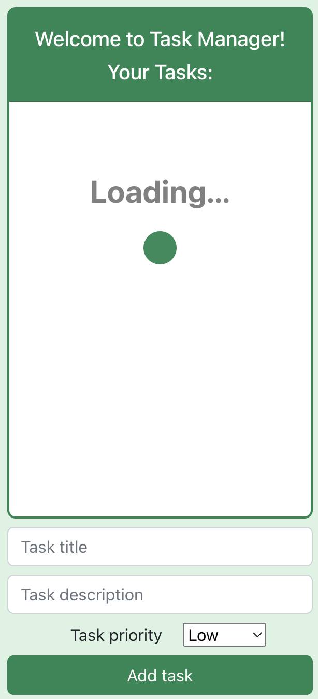

# Task Manager React App

The Task Manager React App is a web application that allows users to manage their tasks in a simple and efficient way. 
Users can add new tasks to the list, edit or remove existing tasks. Each task in the app includes a description and 
a priority level that indicates its relative importance or urgency.

<div>
    
    
    
</div>
<br>
This project was built for OpenBootcamp React Course

It is possible to include optional functionalities such as login and random joke

## Getting Started

To get started with the Task Manager React App, you will need to have Node.js and NPM installed on your machine. 
If you don't have these tools installed, you can download them from the official Node.js website (https://nodejs.org/en/).

Once you have Node.js and NPM installed, you can follow these steps to create and run the app:

Open a terminal window and navigate to the directory where you want to create the app.

Run the following command to install the Create React App tool:
```
sudo npm install -g create-react-app
```

Run the following command to create a new React app called "task_manager":
```
create-react-app task_manager
````

Navigate to the "task_manager" directory:
```
cd task_manager
```

Install the necessary dependencies by running the following commands:
```
npm install bootstrap bootstrap-icons
npm install node-sass
npm install axios
npm install formik yup
npm install react-router-dom
npm install @mui/material @emotion/react @emotion/styled
npm install @mui/icons-material
npm install clsx
npm install rxjs
```

Finally, run the following command to start the app:
```
npm start
```

Open [http://localhost:3000](http://localhost:3000) to view the project in your browser.

## Learn More

You can learn more in the [Create React App documentation](https://facebook.github.io/create-react-app/docs/getting-started).

For more information check out the [React documentation](https://reactjs.org/).
